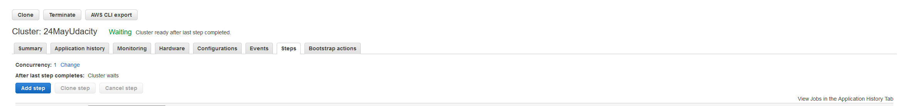

# NanoDegree_DataLake
<h2> Summary </h2>

This project is a data lake implementation of a music streaming data using Pyspark. The data resides in S3 as 2 different types; song and log data in json format.

etl.py file reads those data from s3 (Extract) and processes it to create 5 dimensional tables (Transform) and writes them back to s3 as parquet format.

<h2> How to run the script </h2>
The job can be run using AWS's EMR platform where the cluster can be easily created to perform distributed computing using Spark.
Once the cluster is awake, you can follow the steps to run the etl.py using AWS EMR service:

